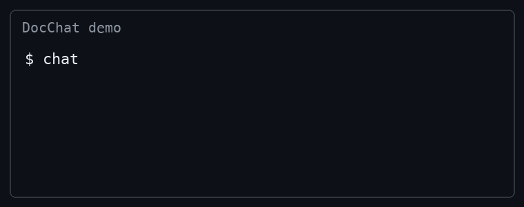

# Groq O'Clock

[](https://github.com/isaiah-debug/groq-o-clock-personal-python-chatbot-project/actions/workflows/doctest.yml)
[](https://github.com/isaiah-debug/groq-o-clock-personal-python-chatbot-project/actions/workflows/integration-test.yml)
[](https://github.com/isaiah-debug/groq-o-clock-personal-python-chatbot-project/actions/workflows/flake8.yml)
[](https://codecov.io/gh/isaiah-debug/groq-o-clock-personal-python-chatbot-project)
[](https://pypi.org/project/cmc-csci040-isaiah-bingham-docsum/)

Groq O'Clock is a terminal chat tool for asking questions about local projects. It supports Groq tool calls plus direct slash commands for `calculate`, `ls`, `cat`, and `grep`.



PyPI: https://pypi.org/project/cmc-csci040-isaiah-bingham-docsum/

## Install

The package is meant to be installed and then used from the terminal with the
`chat` command.

```bash
python -m pip install -e .
export GROQ_API_KEY=your_api_key_here
chat "Use the ls tool on the .github folder and reply with the folder name only."
```

## Usage

The main workflow is asking a normal question and letting Groq decide when to
inspect files with tools.

```text
$ chat "Use the ls tool on the .github folder and reply with the folder name only."
workflows
```

If you want to drive the tools yourself, the slash commands are still available
inside the REPL.

```text
$ chat
chat> /ls .github
workflows
chat> /calculate 6 * 7
42
```

## Test Projects

This example is interesting because it shows the chatbot summarizing a project
without any manual slash commands.

```text
$ cd test_projects/webpage
$ chat
chat> what does this project do?
This is a personal portfolio website built with HTML and CSS.
```

This works because the tool reads project files and summarizes them directly.

This example is interesting because it shows the chatbot using search across the
codebase to answer a code question.

```text
$ cd test_projects/markdown_compiler
$ chat
chat> does this project use regular expressions?
No, I grepped all .py files and found no imports of the `re` module.
```

This works because the tool can automatically grep project files before it
answers.

This example is interesting because it shows the chatbot reading project files
to give a higher-level summary.

```text
$ cd test_projects/ebay_scraper
$ chat
chat> tell me about this project
This project scrapes eBay listings and extracts product titles and prices using BeautifulSoup.
```

This works because the tool can inspect the README and source files before
responding.
